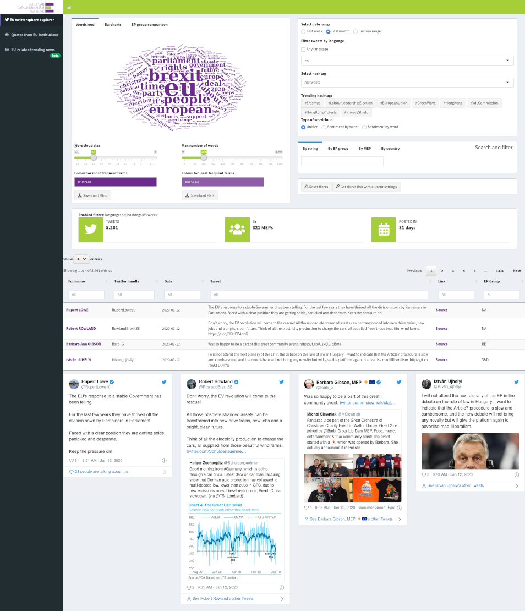
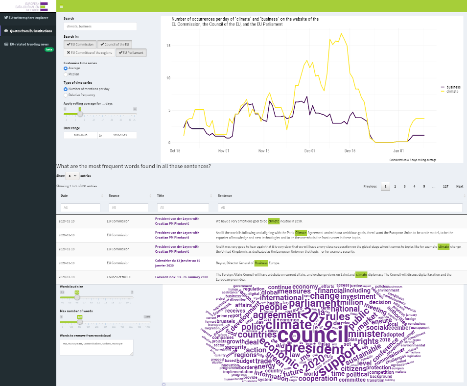
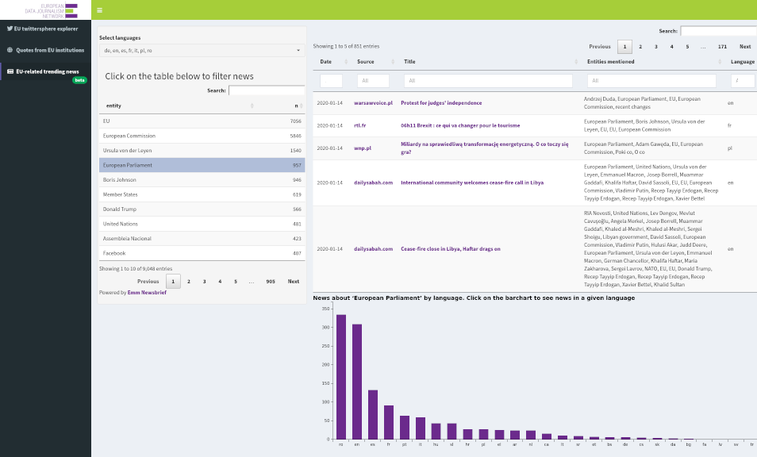

<!-- README.md is generated from README.Rmd. Please edit that file -->

```{r, include = FALSE}
knitr::opts_chunk$set(
  collapse = TRUE,
  comment = "#>",
  fig.path = "man/figures/README-",
  out.width = "100%"
)
```
# EDJNet's Quote Finder

<!-- badges: start -->
[](https://www.tidyverse.org/lifecycle/#experimental)
<!-- badges: end -->

EDJNet's `quotefinder` facilitates finding different takes on European affairs. It provides an interactive interface to explore and filter tweets by all members of the European Parliament who are on Twitter, and to visualise word frequencies as wordclouds. It is possible to filter contents based on keywords, hashtags, political affiliation and language of the tweet. A different interface allows for interactively exploring textual contents published by EU-institutions such as press-releases. In this case, available visualisations include time series in order to highlight changes in the relative prominence of certain issues within the official EU discourse. Finally, the `quotefinder` facilitates the exploration of trending issues related to European affairs across different languages by providing an alternative interface to read news gathered by EMM Newsbrief.


The Quote Finder is based on a purposefully created open source package for the R programming language that effectively deals with data gathering and powers the interactive interface available on EDJNet's website. 

The procedure for data collection and deployment of web apps are documented on the [package's website](https://edjnet.github.io/quotefinder/), making it possible to replicate, expand, or adapt the Quote Finder web apps to other use cases.

## Where can I see the Quote Finder in action?

The web interface generated by the `quotefinder` is currently deployed [on EDJNet's website](https://www.europeandatajournalism.eu/Tools-for-journalists/Quote-Finder/). [Follow this link for a full-screen version](https://applications.europeandatajournalism.eu/quotefinder/).

## How does it look like?

The `quotefinder` interface has currently three separate settings. Looking [at a live version](https://applications.europeandatajournalism.eu/quotefinder/) may be best, but for reference, here are three screenshots.

### Explore MEPs' posts on Twitter


### Explore press releases issued by EU institutions



### Explore through entity-recognition news gathered by EMM Newsbrief



## Technicalities

This is an R package, that you can install as usual with:

```{r eval=FALSE}
remotes::install_github("EDJNet/quotefinder")
```

Its central component is a web interface, created with Shiny, and is ported and updated from [a previous version of the Quote Finder](https://github.com/giocomai/QuoteFinderApp). In addition to the web interface, the package includes a number of convenience functions that facilitate gathering systematically the data fed to the interface, as well as Dockerfiles that facilitate its deployment in production. 

These tools should make it possible to have instances of the `quotefinder` that are dedicated to a specific issue, or to a context completely unrelated to its initial use. This is the long-term goal of the package, but at the current stage adaptation and deployment are admittedly not so straightforward. The Shiny app itself is a port of a previous app built incrementally, and does not make use of modules. 

The re-design of the `quotefinder` as an R package make however these goals more realistic. 

Admirers of beautiful code should look elsewhere. People interested in the long journey from a complex Shiny app built by a relatively inexperienced user to what may be a good practice of how to package a Shiny app that collects data from multiple sources and facilitate its use in production, are encouraged to follow the development of this repository. 

Long-term goals include:

- a set of well-documented convenience functions that gather data (almost there)
- detailed documentation that makes it easy to deploy customised version of the `quotefinder` on an own server with containers (not so far, but even some of the package vignettes that have been included included are still not finalised)
- a core shiny app based on modules that can be easily customised to other purposes (this is a whole journey)


